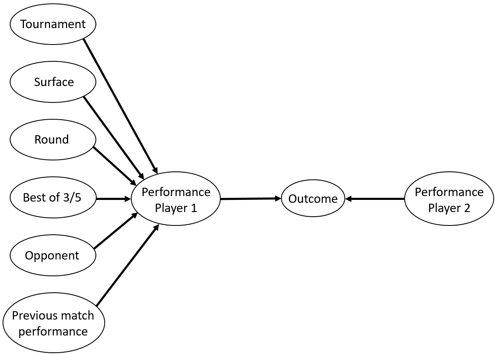

```{r setup, include=FALSE}
knitr::opts_chunk$set(echo = TRUE)
```

What influence the performance of a professional tennis player? Internal factors such as talent, age, mental strength and external factors such as tournament level, surface properties, sets played might all be essential. However, internal factors are often unobservable. We want to find a method that quantifies performance of professional tennis players based on external factors as well as the performance level in the previous match. Having the ability to estimate the perfomance level of a player given a set of conditions enables us to answer questions such as "What is the probability of a player winning a particular match?", "How does a player's performance level change with respect to different tennis surfaces?". 

Little academic work has been done on evaluating the performance of professional tennis players. Shang-Min Ma et al. (2013) analyzed variables related to tennis performance using a logistic regression model. However, their study included match statistics such as number of aces and percentage of 1st serves won. These variables can only be observed after the match and thus are not useful for prediction. Other researchers have tried to quantify player performance using accumulated matches played and won at various tournament levels (Asmita Chitnisa and Omkarprasad Vaidya, 2014) or using direct match statistics (Filipcic Ales et al., 2015). The result of these studies can not be used to compare potential performance level when particular external factors are altered, since they did not seperate the external factors and match specific factors.

There are three main goals this project wish to accomplish. The first one is to reliably estimate the performance level of professional tennis players given different sets of conditions. The second main goal is to compare the perfomance level of famous players in a hypothesized world where the proportion of different tennis surfaces is equal (currently hard courts are the most common with grass courts being the least common). Finally, we want to estimate the probability of players winning particular matches.

The dataset we plan to use is men's tennis ATP tour matches data from 2000 to 2016 including Grand Slams, Masters Series, Masters Cup and International Series competitions. Important variables for our project include tournament name, court, surface, best of 3 or 5, round, player names and the match outcome. The dataset can be found on the Kaggle website: https://www.kaggle.com/jordangoblet/atp-tour-20002016

A graphical model with perfomance as a hidden variable would be used to represent how variables are connected. Parameters in this model would be estimated using MCMC or the EM algorithm. A tentative graphical model is shown below as a graph. 
```{r global_options, include=FALSE}
knitr::opts_chunk$set(fig.pos = 'h')
```

```{r, echo = FALSE, fig.cap = "", out.width = '50%'}

```

The goodness of fit of our model will be evaluated using the accuracy of predicting match outcomes, although the predictive accuracy is not the primary focus of this study.

### References
Shang-Min Ma, Chao-Chin Liu, Yue Tan & Shang-Chun Ma (2013). Winning matches in Grand Slam men's singles: An analysis of player performance-related variables from 1991 to 2008, Journal of Sports Sciences, 31:11, 1147-1155

Asmita Chitnis, Omkarprasad Vaidya (2014). Performance Assessment of Tennis Players: Application of DEA, Procedia - Social and Behavioral Sciences 133, 74-83

Filipcic, Ales; Zecic, Miroslav; Reid, Machar; Crespo, Miguel; Panjan, Andrej; Nejc, Sarabon (2015). Differences in Performance Indicators of Elite Tennis Players in the Period 1991-2010, Journal of Physical Education and Sport 15(4), 671-677